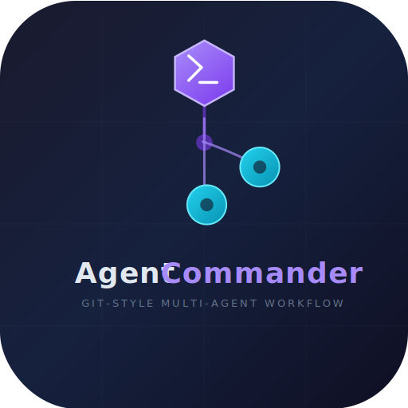

# AgentCommander — Git-style Multi-Agent Collaboration

<p align="center">
  
</p>

A desktop application that implements a **Git-style multi-agent collaboration workflow** — AI agents work together like a real dev team: a Planner decomposes tasks, Developers write solutions, Reviewers check the work, and a Merger integrates approved changes.

Built with **Electron + React + TypeScript + SQLite**.

---

## Features

- **Task Decomposition** — Submit a high-level task; the Planner agent breaks it into structured issues with dependency graphs
- **Kanban Board** — Issues flow through four columns: Open → In Progress → Resolved → Closed
- **Agent Pool** — 6 pre-configured AI agents (1 Planner, 2 Developers, 2 Reviewers, 1 Merger) running concurrently
- **Live Terminals** — Real-time streaming output from every agent
- **Proposal & Review** — Developers submit solutions as proposals; Reviewers approve/reject; Merger auto-merges when all approve
- **Dual Theme** — Dark & light themes with CSS variables
- **Bilingual UI** — 中文 / English toggle
- **Interactive Tutorial** — 7-step onboarding walkthrough with spotlight highlights
- **Multi-API Support** — OpenAI, Anthropic, and any OpenAI-compatible endpoint (Ollama, vLLM, etc.)

---

## Screenshots

| Dark Theme | Light Theme |
|---|---|
| Dark Kanban board with agent terminals | Light theme with bilingual UI |

> Run the app and explore — the tutorial will guide you through every feature.

---

## Quick Start

### Prerequisites

- **Node.js** ≥ 20
- **npm** ≥ 9

### Install & Run

```bash
# Clone
git clone https://github.com/returnSGD/AgentCommander.git
cd AgentCommander/desktop

# Install dependencies
npm install

# Development (Vite HMR + Electron)
npm run dev

# Production build
npm run build

# Package into installer (NSIS on Windows, DMG on macOS, AppImage on Linux)
npm run package
```

### Configure API

1. Open the app
2. Go to **Settings** tab
3. Enter your API URL, key, and model
4. Supported APIs:
   - OpenAI: `https://api.openai.com/v1` with key `sk-...`
   - Anthropic: `https://api.anthropic.com` with key `sk-ant-...`
   - Self-hosted: any OpenAI-compatible endpoint (Ollama, vLLM, etc.)

### Submit Your First Task

1. Go to **Issue Board** tab
2. Type a task description, e.g. _"Build a REST API for user management with JWT authentication"_
3. Click **Submit Task**
4. Watch the Planner agent decompose it into issues
5. Assign issues to developer agents — they'll write solutions and submit proposals
6. Approve proposals to trigger auto-merge

---

## Architecture

```
desktop/
├── src/
│   ├── main/                     # Electron main process
│   │   ├── index.ts              # BrowserWindow, app lifecycle
│   │   ├── preload.ts            # contextBridge API
│   │   ├── ipc-handlers.ts       # IPC channel handlers
│   │   ├── agent-manager.ts      # Agent lifecycle orchestration
│   │   ├── workflow-engine.ts    # Decompose → Work → Review → Merge
│   │   ├── api-client.ts         # OpenAI / Anthropic streaming
│   │   └── state-db.ts           # SQLite (better-sqlite3) CRUD
│   ├── renderer/                 # React frontend
│   │   ├── App.tsx               # Root layout, tabs, providers
│   │   ├── App.css               # CSS variables (dark + light themes)
│   │   ├── i18n/                 # 中/EN translations & context
│   │   ├── theme/                # Dark/light theme context
│   │   └── components/
│   │       ├── TaskInput.tsx      # Task submission
│   │       ├── IssueBoard.tsx     # Kanban + issue detail
│   │       ├── AgentPool.tsx      # Agent grid + controls
│   │       ├── AgentTerminal.tsx  # Live output terminal
│   │       ├── ReviewPanel.tsx    # Proposal review + merge
│   │       ├── SettingsPanel.tsx  # API configuration
│   │       └── Tutorial.tsx       # 7-step onboarding
│   └── shared/
│       └── types.ts              # Shared TypeScript types
├── package.json                  # Electron + dependencies + build config
├── vite.config.ts                # Vite bundler config
└── tsconfig*.json                # TypeScript configs
```

### Data Model

```typescript
Issue → Proposal (PR) → Review × N → Merge
  ↑          ↑              ↑           ↑
Planner    Developer     Reviewers    Merger
```

All state persisted in SQLite (`agent-commander.db`) — settings, issues, proposals, reviews, agents, tasks.

### Agent Roles

| Role | Count | Responsibility |
|---|---|---|
| **Planner** | 1 | Decomposes user tasks into structured issues |
| **Developer** | 2 | Claims issues, generates solutions, submits proposals |
| **Reviewer** | 2 | Reviews proposals for correctness, quality, and security |
| **Merger** | 1 | Auto-merges proposals when all reviews approve |

---

## Build & Release

```bash
cd desktop

# Full build (renderer + main)
npm run build

# Package into platform installer
npm run package
# Output: desktop/release/AgentCommander-1.0.0-setup.exe (Windows)
#         desktop/release/AgentCommander-1.0.0.dmg (macOS)
#         desktop/release/AgentCommander-1.0.0.AppImage (Linux)
```

Build configuration is in `desktop/package.json` under the `"build"` key (electron-builder).

---

## AgentSpace Extension (Legacy)

The original AgentSpace workflow extension code is preserved in this repository. See the sections below for integration details.

<details>
<summary>Click to expand — AgentSpace Workflow Extension</summary>

### Workflow Model

```
Issue → Proposal(PR) → Review × N → Merge/Close
  ↑          ↑              ↑             ↑
Agent A    Agent B      Agents C,D    Auto-merge
```

### Conflict Resolution (3-layer)

| Layer | Mechanism | Implementation |
|---|---|---|
| ① Async Lock | Resource-level mutual exclusion | `workflow_lock` table + UNIQUE constraint with TTL auto-expiry |
| ② Sync Queue | FIFO serialization | `workflow_operation_queue` table, priority-sorted, `processQueue()` acquires lock per item |
| ③ State DB | Optimistic locking via version | `version` column, `UPDATE ... WHERE version = ?`, conflicts logged to `workflow_conflict` |

### Installation

```bash
# 1. Copy new files
cp -r extension/domain/src/*   AgentSpace/packages/domain/src/
cp -r extension/db/src/*       AgentSpace/packages/db/src/
cp -r extension/services/src/* AgentSpace/packages/services/src/

# 2. Overlay modified files
cp modified/domain/src/workspace.ts      AgentSpace/packages/domain/src/
cp modified/domain/src/index.ts          AgentSpace/packages/domain/src/
cp modified/db/src/types.ts              AgentSpace/packages/db/src/
cp modified/db/src/postgres-schema.ts    AgentSpace/packages/db/src/
cp modified/db/src/index.ts              AgentSpace/packages/db/src/
cp modified/services/src/index.ts        AgentSpace/packages/services/src/

# 3. Install
cd AgentSpace && npm run setup
```

### Quick Example

```typescript
import { WorkflowOrchestrator } from "@agent-space/services";

const wf = new WorkflowOrchestrator();

const issue = wf.openIssue({
  title: "Optimize search performance",
  description: "Latency needs to go from 2s to 200ms",
  createdBy: "architect-agent",
  priority: "high",
  enqueueTask: true,
});

const { proposal } = wf.submitProposal({
  issueId: issue.id,
  title: "Introduce Elasticsearch",
  description: "Replace SQL LIKE with ES inverted index",
  proposedBy: "dev-agent",
  reviewers: ["qa-agent", "security-agent"],
});

wf.reviewProposal({
  reviewId: "wfr-xxx",
  reviewerId: "qa-agent",
  status: "approved",
  summary: "LGTM",
  expectedVersion: 1,
});
// All reviews approved → auto-merge → issue closed
```

</details>

---

## License

MIT
